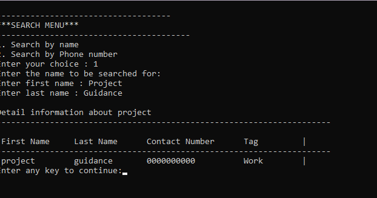

# Phonebook-Management-System
Phonebook management system in C is a console application without graphics.

## Functions that are used in this project:
1. [void add_contact():](#AddContact)     -------> *It's a utility function to add a contact into the directory*
2. [void search_contact():](#SearchContact)  -------> *It's a utility function to search for a contact*
3. [void modify_contact():](#ModifyContact)   -------> *It's a utility function to modify a contact*
4. [void display():](#Display)         -------> *It's a utility function to display all contacts within the directory*
5. [int directory_info():](#DirectoryInfo)   -------> *It's a utility function to find out the total no.of contacts in the directory*
6. [void display_by_tag():](#DisplayByTag)   -------> *It's a utility function to display all the contacts with the specified tag*
7. [int tag_info():](#TagInfo)          -------> *It's a utility function to find out the total no.of contacts that are saved in specified tag*
8. [void delete_contact():](#DeleteContact)   -------> *It's a utility function to delete a contact from the directory* 

## Output:
 
 
 
 
 
 
 
 
 
 
 
 
