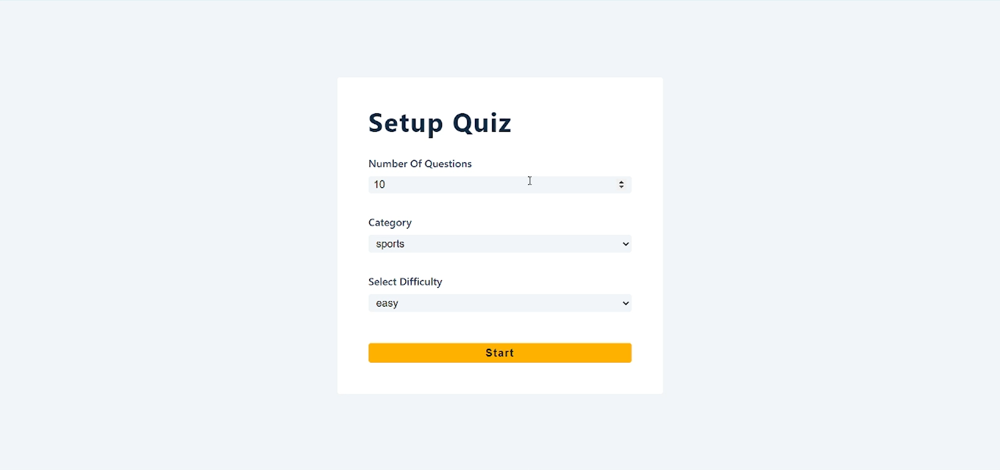
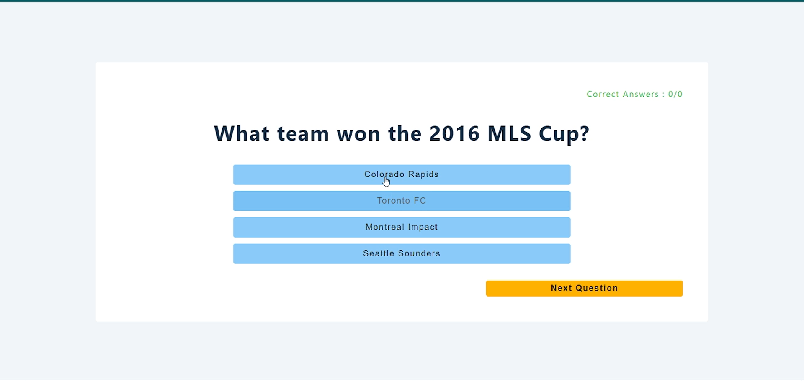
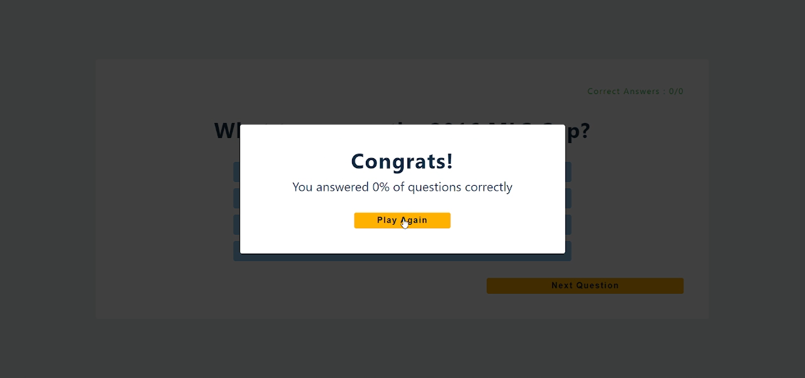

## Description
Quiz React App is an application where you can exericise your brain with some random GK question of your choosen stream. 

## Tech Stack
1. ReactJS
2. CSS
3. API

## Demostration

 
 
 

## Quick Start (Run on Local System)
- cd `React`
- cd `Quiz App`
- Use `npm install` in the terminal to install all the package dependencies.
- To run just use `npm start` it will start running at `localhost:3000`
- Enjoy ~
