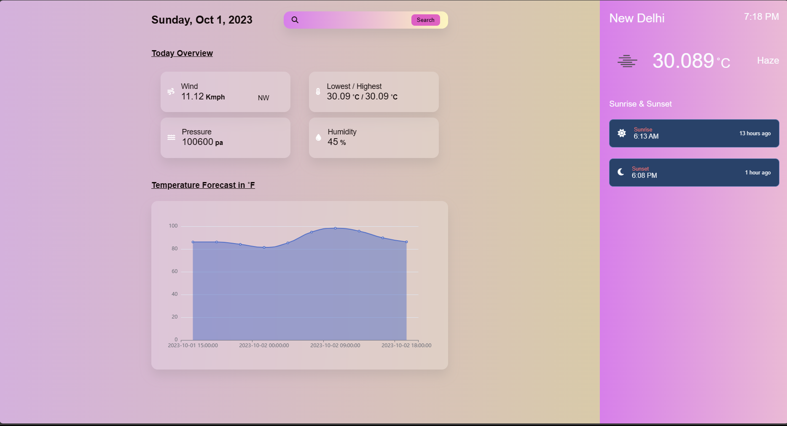

# WeatherApp

A web application dedicated to displaying OpenWeatherMap weather forecasts.

## Sample Output

## Functionalities

- Weather forecast of Preset Day
    - Weather (clouds / sun / rain / ...)
    - Temperature, Humidity, Pressure
    - Wind Speed & Direction
    - Lowest/Highest temperatue recorded on a day 
    - Sunrise, Sunset
- Display weather forecast from a city name
    - Search a city via the input in the form
- Displays Temperature Forecast in ˚F with the help of Graph
- Responsive application
