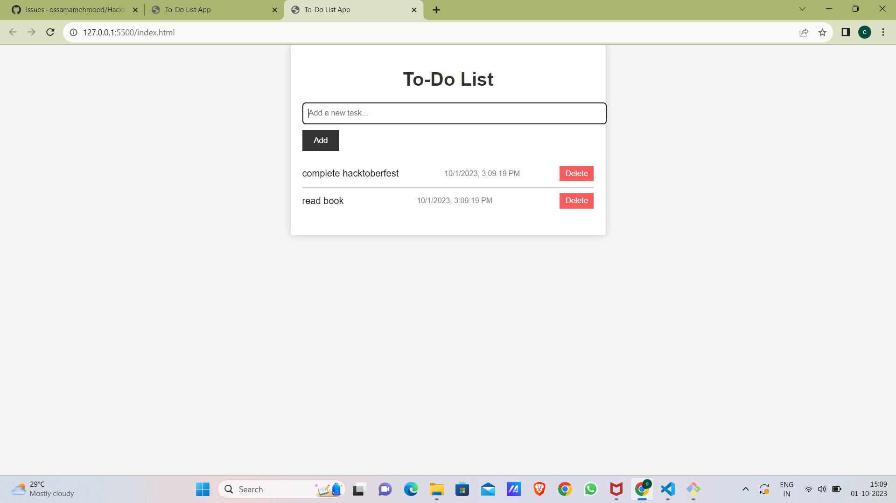

# To-Do List App

A simple to-do list web application that allows you to add tasks with timestamps and using local storage.

## Features

- Add tasks to your to-do list with timestamps.
- Delete tasks from the list.
- Persistence with local storage, so your tasks are saved even if you close the browser.

